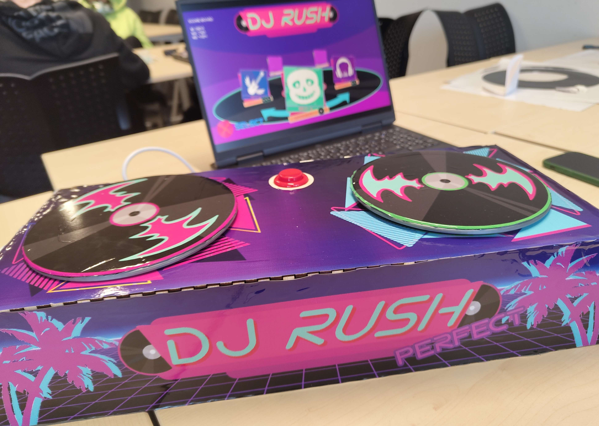

# DJ Rush

A 2D arcade rhythm game, product of a group project, in which Engineers, Designers and Artist come together to develop a game in 2 weeks.

   
  *<i>Low frame rate caused by gif limitations</i>*

The game supports control input handling from a custom-made arcade controller.

   

## Overview

A game in which the player is a DJ and by utilizing an arcade DJ station, he/she must try to keep track of mix tiles that come in.
The player's task is to perform the best he/she can by scoring as much points as possible, therefore satisfying the crowd and keeping the vibe going.
For each level, there is a score board, storing the best performances of other players that have also played the game.

Developed by utilizing the GxP 2D Game Engine, provided by the institution.

## Features

### Gameplay (Engineers)

- **Normal tiles:** Depending on the side, which the given tile is coming from, the player should rotate the corresponding controller disc towards the direction indicated on the tile itself
- **Stroke tiles:** Similar to the normal tiles, however, now the player would have to keep spinning in the correct direction until the end of the stroke in order to get the most points possible
- **Deny tiles:** When deny tiles come towards the player, he/she can "avoid" them by pressing on the red deny button at the center of the controller

### UI/UX, SFX, VFX (Artist)

- **Songs menu**
- **HUD:**
  2. Score
- **Sounds**
  1. Songs
  2. Sound effects
- **Particle:**
  1. Reaction time particles

## Controls

- Player can move the DJ discs left and right and press the red button at the center of the controller

## Controller design and build
Done by: @Johnny Rest van der

## Art
Done by: @Sami Ljatifi
